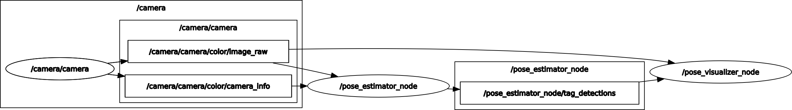

# AprilTag Pose ROS2

**AprilTag 기반 실시간 6-DOF 포즈 추정 시스템**

[](https://docs.ros.org/en/humble/)
[](https://isocpp.org/)
[](https://www.python.org/)
[](https://opencv.org/)
[](docker/)
[](LICENSE)

---

## 목차

- [데모](#데모)
- [개요](#개요)
- [주요 기능](#주요-기능)
- [시스템 구조](#시스템-구조)
- [프로젝트 구조](#프로젝트-구조)
- [빠른 시작](#빠른-시작)
- [시스템 요구사항](#시스템-요구사항)
- [설치](#설치)
- [빌드](#빌드)
- [실행](#실행)
- [사용법](#사용법)
- [설정](#설정)
- [API / 인터페이스](#api--인터페이스)
- [문제 해결](#문제-해결)
- [라이선스](#라이선스)
- [Maintainer](#maintainer)

---

## 데모

<details>
<summary>ROS2 Graph</summary>



</details>

---

## 개요

### 프로젝트 목적

AprilTag Pose ROS2는 Intel RealSense 카메라와 AprilTag 마커를 활용하여 타겟 객체의 6자유도(6-DOF) 위치와 자세를 실시간으로 추정하는 시스템입니다. 다중 마커 융합 알고리즘(Multi-tag PnP)을 적용하여 단일 마커 대비 높은 정확도를 달성하며, SLERP 기반 쿼터니언 필터로 안정적인 포즈 출력을 제공합니다.

### 주요 구성요소

- **realsense2_camera** (C++): Intel RealSense D435/D455 공식 ROS2 드라이버
- **apriltag_pose_estimator** (C++): AprilTag 검출, 다중 마커 포즈 융합, SLERP 필터링
- **apriltag_pose_visualizer** (Python): 실시간 검출 결과 시각화, Roll/Pitch/Yaw 계산, 3D 산점도
- **apriltag_pose_estimator_msgs** (C++): ROS2 커스텀 메시지 및 서비스 인터페이스

### 적용 가능 영역

- 로봇 비전 시스템의 객체 위치 추적
- 자율 네비게이션을 위한 공간 인식
- 산업 자동화 시스템의 정밀 포지셔닝
- AR/VR 마커 기반 위치 추정
- 연구 개발 및 교육

---

## 주요 기능

- **다중 마커 PnP 융합**: 복수의 AprilTag 코너를 동시에 활용하여 단일 마커 대비 향상된 6-DOF 포즈 추정
- **SLERP 쿼터니언 필터**: Gimbal lock 없는 회전 보간과 적응형 EMA로 프레임 간 지터 억제
- **Reprojection Error 기반 이상치 제거**: 15픽셀 임계값으로 불량 검출 자동 필터링
- **고성능 C++ 파이프라인**: 실시간 처리에 적합한 네이티브 구현 (5-8ms/frame @ 1280x720)
- **YAML 기반 유연한 설정**: 마커 ID, 크기, 오프셋, 타겟 포인트를 설정 파일로 관리
- **실시간 3D 시각화**: 위치(tvec) 및 회전(RPY) 히스토리의 3D 산점도와 통계 오버레이
- **서비스 인터페이스**: 온디맨드 포즈 쿼리를 위한 ROS2 서비스 제공
- **Docker 지원**: 빌드 및 실행 스크립트 포함, 원클릭 컨테이너 환경

---

## 시스템 구조

```
┌──────────────────────────────────────────────────────────────────────┐
│                      AprilTag Pose ROS2 System                       │
└──────────────────────────────────────────────────────────────────────┘

    Intel RealSense D435/D455
              │
              │ USB 3.0
              ▼
    ┌───────────────────────┐
    │  realsense2_camera    │  (C++)
    │  - Camera streaming   │
    │  - Intrinsics publish │
    └───────────┬───────────┘
                │  /color/image_raw
                │  /color/camera_info
                ▼
    ┌───────────────────────┐     ┌───────────────────────┐
    │ apriltag_pose_        │     │ apriltag_pose_        │
    │ estimator             │────▶│ visualizer            │  (Python)
    │  - Tag detection      │     │  - Overlay drawing    │
    │  - Multi-tag PnP      │     │  - RPY calculation    │
    │  - SLERP filtering    │     │  - 3D scatter plots   │
    │  - Outlier rejection  │     └───────────────────────┘
    └───────────┬───────────┘
                │  /target_poses
                │  /tag_detections
                ▼
         Service Client
    (target_point_pose query)
```

---

## 프로젝트 구조

```
AprilTag_Pose_ROS2/
├── apriltag_pose_estimator/                # 포즈 추정 패키지 (C++)
│   ├── src/
│   │   ├── pose_estimator_node.cpp         # ROS2 노드 구현
│   │   ├── april_tag_detector.cpp          # AprilTag 검출 래퍼
│   │   ├── multi_tag_pose_estimator.cpp    # 다중 마커 PnP 융합
│   │   ├── slerp_pose_filter.cpp           # 쿼터니언 SLERP 필터
│   │   └── main.cpp                        # 엔트리 포인트
│   ├── include/apriltag_pose_estimator/
│   │   ├── pose_estimator_node.hpp
│   │   ├── april_tag_detector.hpp
│   │   ├── multi_tag_pose_estimator.hpp
│   │   ├── slerp_pose_filter.hpp
│   │   └── tag_config.hpp                  # 데이터 구조 정의
│   ├── config/
│   │   └── pose_estimator.yaml             # 설정 파일
│   ├── launch/
│   │   └── apriltag_estimator.launch.py    # 런치 파일
│   ├── CMakeLists.txt
│   └── package.xml
├── apriltag_pose_estimator_msgs/           # 커스텀 인터페이스
│   ├── msg/
│   │   └── TagDetection.msg
│   ├── srv/
│   │   └── TargetPointPose.srv
│   ├── CMakeLists.txt
│   └── package.xml
├── apriltag_pose_visualizer/               # 시각화 패키지 (Python)
│   ├── apriltag_pose_visualizer/
│   │   └── pose_visualizer_node.py
│   ├── setup.py
│   └── package.xml
├── docker/                                 # Docker 환경
│   ├── Dockerfile
│   ├── build.sh
│   ├── run.sh
│   ├── entrypoint.sh
│   ├── aliases.sh
│   └── config.sh.example
├── docs/
│   └── launch_ros_graph.png
└── realsense-ros.repos                     # RealSense ROS2 드라이버 VCS 파일
```

---

## 빠른 시작

### Option 1: Docker (권장)

```bash
# 1. Docker 이미지 가져오기
docker pull hhanoo/project:apriltag-pose-ros2-humble

# 2. 컨테이너 실행 (X11 포워딩 포함)
cd AprilTag_Pose_ROS2/docker
./run.sh

# 3. 컨테이너 내부에서 의존성 가져오기 및 빌드
cd /ros2_ws
vcs import src < src/AprilTag_Pose_ROS2/realsense-ros.repos
colcon build

# 4. 실행 (터미널 2개)
run_cam   # ros2 launch realsense2_camera rs_launch.py ...
run_est   # ros2 launch apriltag_pose_estimator apriltag_estimator.launch.py
```

### Option 2: Native

```bash
# 1. 의존성 가져오기 및 빌드
cd ~/ros2_ws
vcs import src < src/AprilTag_Pose_ROS2/realsense-ros.repos
rosdep install --from-paths src --ignore-src -r -y
colcon build
source install/setup.bash

# 2. 실행 (터미널 2개)
ros2 launch realsense2_camera rs_launch.py
ros2 launch apriltag_pose_estimator apriltag_estimator.launch.py
```

---

## 시스템 요구사항

### 필수

| 항목   | 요구사항                  |
| ------ | ------------------------- |
| OS     | Ubuntu 22.04 LTS          |
| ROS2   | Humble                    |
| Python | 3.10+                     |
| C++    | C++17 (GCC 9+, Clang 10+) |

### 하드웨어

| 항목   | 사양                               |
| ------ | ---------------------------------- |
| Camera | Intel RealSense D415 / D435 / D455 |
| USB    | USB 3.0 포트 (필수)                |
| CPU    | 멀티코어 프로세서 (Intel i5+ 권장) |
| RAM    | 4GB 이상 (8GB 권장)                |

### 소프트웨어 의존성

**시스템 라이브러리:**

- `libapriltag-dev` - AprilTag C 라이브러리
- `libopencv-dev` - OpenCV 4.x
- `libeigen3-dev` - Eigen3 선형대수 라이브러리
- `ros-humble-realsense2-*` - RealSense SDK ROS2 패키지

**Python 패키지:**

- `numpy` (<2.0, cv_bridge 호환)
- `pyrealsense2` (==2.56.5.9235)
- `dt-apriltags` (==3.1.7)
- `opencv-python` (==4.10.0.84)
- `matplotlib` (3D 시각화)

### 외부 패키지

| 패키지        | 출처                                                                                | 용도                          |
| ------------- | ----------------------------------------------------------------------------------- | ----------------------------- |
| realsense-ros | [realsenseai/realsense-ros](https://github.com/realsenseai/realsense-ros) (v4.55.1) | Intel RealSense ROS2 드라이버 |

---

## 설치

### Method 1: Docker (권장)

Docker를 사용하면 모든 의존성이 자동으로 설치됩니다.

```bash
# 1. Docker 이미지 가져오기
docker pull hhanoo/project:apriltag-pose-ros2-humble

# 2. 컨테이너 실행
cd AprilTag_Pose_ROS2/docker
./run.sh
```

<details>
<summary>직접 빌드 (개발자용)</summary>

```bash
# 0. 프로젝트 루트로 이동
cd AprilTag_Pose_ROS2/docker

# 1. 설정 파일 생성 후 IMAGE_NAME을 로컬 이름으로 변경
cp config.sh.example config.sh
# config.sh에서 IMAGE_NAME="apriltag-pose-ros2-humble" 로 수정

# 2. Docker 이미지 빌드
./build.sh

# 3. 컨테이너 실행
./run.sh
```

</details>

### Method 2: Native

#### 1. ROS2 Humble 설치

[ROS2 Humble 공식 설치 가이드](https://docs.ros.org/en/humble/Installation.html)를 참고하세요.

#### 2. VCS 의존성 가져오기

```bash
cd ~/ros2_ws
vcs import src < src/AprilTag_Pose_ROS2/realsense-ros.repos
```

#### 3. 시스템 의존성 설치

```bash
sudo apt update
sudo apt install -y \
  build-essential cmake git \
  python3-pip python3-colcon-common-extensions python3-rosdep \
  libapriltag-dev libopencv-dev libeigen3-dev \
  ros-humble-realsense2-*
```

#### 4. Python 패키지 설치

```bash
pip3 install \
  setuptools==58.2.0 packaging==21.3 wheel \
  'numpy>=1.21.0,<2.0' \
  pyrealsense2==2.56.5.9235 \
  dt-apriltags==3.1.7 \
  opencv-python==4.10.0.84
```

#### 5. ROS 의존성 설치

```bash
cd ~/ros2_ws
rosdep update
rosdep install --from-paths src --ignore-src -r -y
```

---

## 빌드

### 전체 빌드

```bash
cd ~/ros2_ws
colcon build --symlink-install
source install/setup.bash
```

### 특정 패키지 빌드

```bash
colcon build --symlink-install --packages-select apriltag_pose_estimator
source install/setup.bash
```

### 릴리스 빌드

```bash
colcon build --cmake-args -DCMAKE_BUILD_TYPE=Release
```

### 클린 빌드

```bash
cd ~/ros2_ws
rm -rf build install log
colcon build --symlink-install
source install/setup.bash
```

---

## 실행

실행 순서를 반드시 준수하세요. `apriltag_estimator.launch.py`에는 카메라가 포함되어 있지 않습니다.

### 전체 시스템 실행

```bash
# 터미널 1: RealSense 카메라 실행 (먼저)
source ~/ros2_ws/install/setup.bash
ros2 launch realsense2_camera rs_launch.py \
  rgb_camera.color_profile:=1280x720x30 \
  enable_depth:=false

# 터미널 2: AprilTag 포즈 추정기 실행
source ~/ros2_ws/install/setup.bash
ros2 launch apriltag_pose_estimator apriltag_estimator.launch.py

# 터미널 3 (선택): 시각화 노드 실행
source ~/ros2_ws/install/setup.bash
ros2 run apriltag_pose_visualizer pose_visualizer_node
```

### 개별 노드 실행

```bash
# 커스텀 카메라 토픽 지정
ros2 launch apriltag_pose_estimator apriltag_estimator.launch.py \
  camera_topic:=camera/camera/color/image_raw \
  camera_info_topic:=camera/camera/color/camera_info

# 태그 파라미터 변경
ros2 launch apriltag_pose_estimator apriltag_estimator.launch.py \
  tag_size:=0.05 \
  tag_family:=tag36h11

# 커스텀 설정 파일 사용
ros2 launch apriltag_pose_estimator apriltag_estimator.launch.py \
  config_file:=/path/to/custom_config.yaml

# GUI 윈도우 비활성화 (Docker / headless 환경)
ros2 launch apriltag_pose_estimator apriltag_estimator.launch.py \
  show_service_result_window:=false
```

### Docker 실행

```bash
docker pull hhanoo/project:apriltag-pose-ros2-humble
cd docker
./run.sh

# 컨테이너 내부
cd /ros2_ws
colcon build && source install/setup.bash
ros2 launch realsense2_camera rs_launch.py
```

전체 alias 정의는 [aliases.sh](docker/aliases.sh)를 참고하세요.

| Alias       | 설명                   | 참고                                                                                                   |
| ----------- | ---------------------- | ------------------------------------------------------------------------------------------------------ |
| `run_cam`   | RealSense 카메라 실행  | [rs_launch.py](https://github.com/realsenseai/realsense-ros/tree/ros2-master/realsense2_camera/launch) |
| `run_est`   | 포즈 추정기 실행       | [apriltag_estimator.launch.py](apriltag_pose_estimator/launch/apriltag_estimator.launch.py)            |
| `run_viz`   | 시각화 노드 실행       | [pose_visualizer_node.py](apriltag_pose_visualizer/apriltag_pose_visualizer/pose_visualizer_node.py)   |
| `echo_pose` | 포즈 토픽 모니터링     | --                                                                                                     |
| `call_pose` | 포즈 서비스 호출       | [TargetPointPose.srv](apriltag_pose_estimator_msgs/srv/TargetPointPose.srv)                            |
| `cmd_help`  | 사용 가능한 alias 목록 | 컨테이너 접속 시 자동 출력                                                                             |

---

## 사용법

### 워크플로우

```
카메라 연결 확인 ──────▶ 시스템 실행 ───────▶ 토픽 모니터링 ──────▶ 서비스 호출
       │                  │                  │                 │
  rs-enumerate       launch x2         topic echo         service call
    -devices         (cam + est)       /target_poses    /target_point_pose
```

#### 1. 카메라 연결 확인

```bash
rs-enumerate-devices
```

#### 2. 시스템 실행

```bash
ros2 launch realsense2_camera rs_launch.py
ros2 launch apriltag_pose_estimator apriltag_estimator.launch.py
```

#### 3. 토픽 모니터링

```bash
# 활성 토픽 확인
ros2 topic list

# 검출된 포즈 확인
ros2 topic echo /pose_estimator_node/target_poses

# 이미지 확인
ros2 run rqt_image_view rqt_image_view
```

#### 4. 서비스 호출

```bash
ros2 service call /pose_estimator_node/target_point_pose \
  apriltag_pose_estimator_msgs/srv/TargetPointPose \
  "{request_time: {sec: 0, nanosec: 0}}"
```

#### 5. RViz2 시각화

```bash
rviz2
# Add > By topic > /visualization_markers > MarkerArray
# Fixed Frame: camera_color_optical_frame
```

---

## 설정

### Docker 설정

[config.sh](docker/config.sh.example)

```bash
IMAGE_NAME="hhanoo/project:apriltag-pose-ros2-humble"  # Docker Hub 이미지 (기본값)
CONTAINER_NAME="apriltag-pose-ros2-humble"              # Docker 컨테이너 이름
```

> `run.sh` 실행 전 `docker pull hhanoo/project:apriltag-pose-ros2-humble`로 이미지를 가져오세요.
>
> 직접 빌드하려면 `IMAGE_NAME`을 `"apriltag-pose-ros2-humble"` 등으로 변경 후 `./build.sh`를 실행하세요.

### pose_estimator.yaml

[apriltag_pose_estimator/config/pose_estimator.yaml](apriltag_pose_estimator/config/pose_estimator.yaml)

<!-- prettier-ignore -->
```yaml
pose_estimator_node:
  ros__parameters:
    # AprilTag 설정
    marker_ids: [0, 1, 2]               # 검출할 태그 ID 목록
    base_marker_id: 1                   # 기준 마커 ID (-1: 첫 번째 마커)
    tag_size: 0.02778                   # 태그 크기 (m)
    tag_family: 'tagStandard41h12'      # 태그 패밀리 (tag36h11 | tagStandard41h12)
    marker_offsets: [0.065, 0.0]        # 마커 간 [X, Y] 간격 (m)

    # 타겟 포인트 (x, y, z, roll, pitch, yaw) x N
    target_points: [
         0.000, 0.000, 0.000,  0.000, 0.000, 0.0000,  # Point 0 (x y z r p y)
         0.000, 0.000, 0.000,  0.000, 0.000, 1.5708,  # Point 1 (x y z r p y)
    ]

    # 입력 토픽
    camera_topic: 'camera/camera/color/image_raw'         # 카메라 이미지 입력
    camera_info_topic: 'camera/camera/color/camera_info'  # 카메라 정보 입력
    camera_frame: 'camera_color_optical_frame'

    # 왜곡 처리
    #   false: rectified 이미지 사용 (왜곡 없음) — RealSense D4xx color 기본값
    #   true : raw 이미지 사용, camera_info.d 의 왜곡 계수로 PnP 수행
    #          — Orbbec Femto Bolt 등 raw 이미지를 구독할 때 필요
    use_distortion_from_camera_info: false

    # 출력 옵션
    publish_visualization: true         # RViz2 마커 퍼블리시
    publish_detection_image: true       # 검출 오버레이 이미지 퍼블리시

    # 서비스 옵션
    show_service_result_window: false   # 서비스 결과 OpenCV 윈도우 (headless 시 false)
    display_width: 0                    # 결과 윈도우 너비 (0 = 원본 크기)
    display_height: 0                   # 결과 윈도우 높이 (0 = 원본 크기)
```

### 주요 파라미터 설명

- **tag_size**: AprilTag 검은색 사각형의 한 변 길이(m). 정확도에 직접적으로 영향
- **marker_offsets**: 마커 중심 간 실제 물리적 거리 `[X, Y]` (m)
- **target_points**: 베이스 마커 기준 타겟 포인트의 상대 위치 및 회전 (라디안)
- **use_distortion_from_camera_info**: PnP 시 사용할 왜곡 계수 소스 선택
  - `false` (기본): 왜곡 계수를 0 으로 간주. 이미 rectified 된 이미지(RealSense D4xx color 등)에 사용
  - `true`: `camera_info.d` 의 값을 그대로 사용. raw 이미지를 구독하는 카메라(Orbbec Femto Bolt 등)에 사용
- **display_width / display_height**: 서비스 결과 윈도우 크기. `0`이면 원본 해상도 그대로 표시

### Launch 인수

| 인수                         | 기본값                | 설명                          |
| ---------------------------- | --------------------- | ----------------------------- |
| `config_file`                | `pose_estimator.yaml` | YAML 설정 파일 경로           |
| `show_service_result_window` | `""` (YAML 값 사용)   | 서비스 결과 윈도우 표시 여부  |
| `camera_topic`               | `""` (YAML 값 사용)   | 카메라 이미지 토픽 오버라이드 |
| `camera_info_topic`          | `""` (YAML 값 사용)   | 카메라 정보 토픽 오버라이드   |
| `tag_family`                 | `""` (YAML 값 사용)   | 태그 패밀리 오버라이드        |
| `tag_size`                   | `""` (YAML 값 사용)   | 태그 크기 오버라이드          |

---

## API / ROS2 인터페이스

### 노드

| 노드                   | 언어   | 패키지                   | 설명                         |
| ---------------------- | ------ | ------------------------ | ---------------------------- |
| `realsense_node`       | C++    | realsense2_camera        | RealSense 카메라 스트리밍    |
| `pose_estimator_node`  | C++    | apriltag_pose_estimator  | AprilTag 검출 및 포즈 추정   |
| `pose_visualizer_node` | Python | apriltag_pose_visualizer | 검출 결과 시각화 및 RPY 계산 |

### Published 토픽

| 토픽                                   | 타입                                        | 퍼블리셔            | 설명                  |
| -------------------------------------- | ------------------------------------------- | ------------------- | --------------------- |
| `/color/image_raw`                     | `sensor_msgs/Image`                         | realsense_node      | RGB 카메라 이미지     |
| `/color/camera_info`                   | `sensor_msgs/CameraInfo`                    | realsense_node      | 카메라 내부 파라미터  |
| `/pose_estimator_node/tag_detections`  | `apriltag_pose_estimator_msgs/TagDetection` | pose_estimator_node | 태그 검출 데이터      |
| `/pose_estimator_node/target_poses`    | `geometry_msgs/PoseArray`                   | pose_estimator_node | 타겟 포인트 포즈 배열 |
| `/pose_estimator_node/detection_image` | `sensor_msgs/Image`                         | pose_estimator_node | 검출 오버레이 이미지  |
| `/visualization_markers`               | `visualization_msgs/MarkerArray`            | pose_estimator_node | RViz2 시각화 마커     |

### Subscribed 토픽

| 토픽                               | 타입                     | 서브스크라이버      | 설명                     |
| ---------------------------------- | ------------------------ | ------------------- | ------------------------ |
| `/camera/camera/color/image_raw`   | `sensor_msgs/Image`      | pose_estimator_node | 입력 카메라 이미지       |
| `/camera/camera/color/camera_info` | `sensor_msgs/CameraInfo` | pose_estimator_node | 카메라 캘리브레이션 정보 |

### 서비스

| 서비스                                   | 타입              | 제공자              | 설명                |
| ---------------------------------------- | ----------------- | ------------------- | ------------------- |
| `/pose_estimator_node/target_point_pose` | `TargetPointPose` | pose_estimator_node | 최신 검출 포즈 쿼리 |

### 커스텀 메시지

**TagDetection.msg:**

```msg
bool       tag_detected    # 태그 검출 플래그
float64[9] camera_matrix   # 3x3 내부 파라미터 행렬 (row-major)
float64[]  dist_coeffs     # 왜곡 계수 (OpenCV 순서)
float64[3] rvec            # Rodrigues 회전 벡터
float64[3] tvec            # 병진 벡터 (m)
float64    tag_size        # 태그 크기 (m)
```

**TargetPointPose.srv:**

```srv
# Request
builtin_interfaces/Time request_time    # 요청 시각
---
# Response
bool success                            # 성공 여부
string message                          # 상태 메시지
builtin_interfaces/Time data_time       # 데이터 타임스탬프
geometry_msgs/PoseArray poses           # 타겟 포즈 배열
```

### 네트워크 구성 (Docker)

| 항목          | 값               | 설명                  |
| ------------- | ---------------- | --------------------- |
| Network mode  | `host`           | 호스트 네트워크 공유  |
| ROS_DOMAIN_ID | `99`             | ROS2 도메인 ID        |
| IPC           | `host`           | IPC 네임스페이스 공유 |
| X11           | `/tmp/.X11-unix` | GUI 포워딩            |

---

## 문제 해결

### 1. "No RealSense devices detected"

```
[ERROR] No RealSense devices were found!
```

```bash
# USB 연결 확인
lsusb | grep Intel

# 커널 모듈 로드
sudo modprobe uvcvideo

# 권한 설정
sudo usermod -aG video $USER
sudo usermod -aG plugdev $USER
# 로그아웃 후 재로그인
```

### 2. "No AprilTags detected"

```
[WARN] No tags detected in current frame
```

```bash
# 확인 사항:
# - 조명: 밝고 균일한 조명 (그림자 최소화)
# - 초점: 카메라 초점이 태그에 맞춰져 있는지 확인
# - 거리: 카메라-태그 간 0.3m ~ 3m 권장
# - 각도: 태그가 카메라를 향하도록 (< 45도)

# config에서 태그 크기와 패밀리가 실제와 일치하는지 확인
# tag_size: 0.02778  (실측값을 미터 단위로)
# tag_family: 'tagStandard41h12'  (인쇄한 태그와 동일해야 함)
```

### 3. 포즈 불안정/지터링

```
# 포즈 추정값이 크게 흔들리는 경우
```

```bash
# 1. tag_size 값이 실측치와 정확히 일치하는지 확인 (mm -> m 변환 주의)
# 2. marker_offsets 값이 마커 간 실제 거리와 일치하는지 확인
# 3. 해상도를 높이거나 프레임 레이트를 낮춰서 이미지 품질 개선
ros2 launch realsense2_camera rs_launch.py \
  rgb_camera.color_profile:=1280x720x15
```

### 4. "Could not find libapriltag-dev"

```
CMake Error: Could not find libapriltag
```

```bash
sudo apt update
sudo apt install -y libapriltag-dev

# 여전히 실패 시
sudo add-apt-repository universe
sudo apt update
sudo apt install -y libapriltag-dev
```

### 5. cv_bridge NumPy 버전 충돌

```
ImportError: numpy.core.multiarray failed to import
```

```bash
pip3 install 'numpy>=1.21.0,<2.0'
```

---

## 라이선스

이 프로젝트는 MIT 라이선스로 배포됩니다. 자세한 내용은 [LICENSE](LICENSE) 파일을 참조하세요.

---

## Maintainer

**hhanoo** (woo980711@gmail.com)
